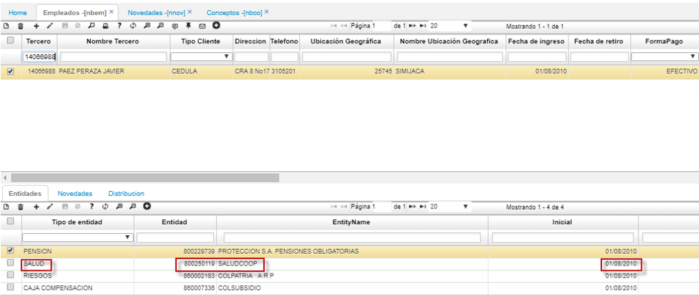
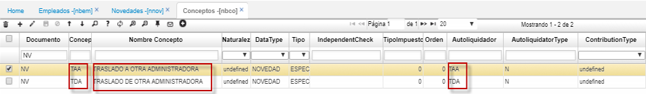
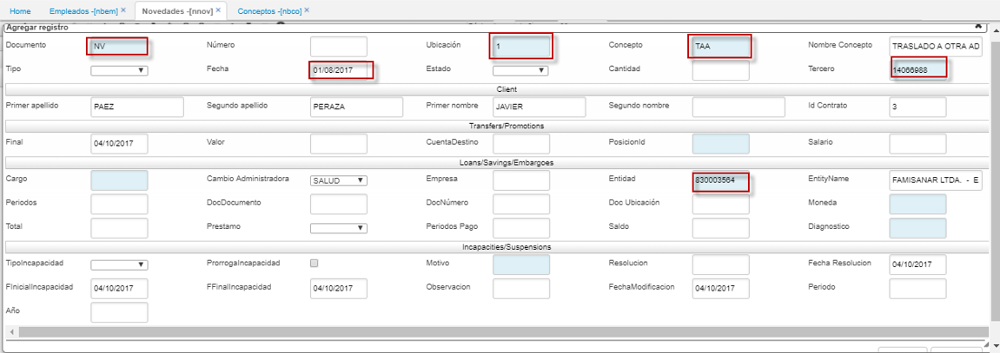
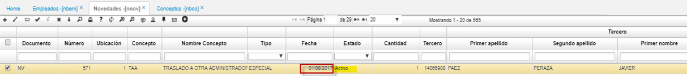
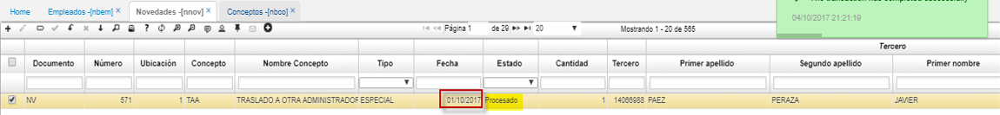
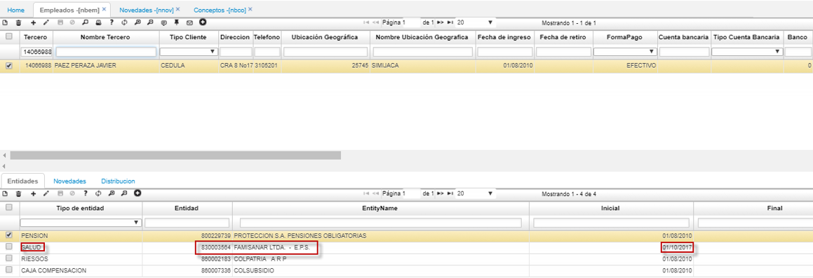
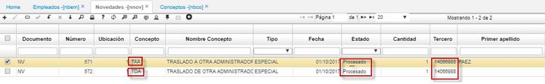

# Elaboración de Novedades TAA

#### Realizar Traslado a Otra Entidad por medio de una Novedad NNOV en OASISCOM  

Para realizar el cambio de una entidad administradora como lo son las entidades de salud y pensión en OASISCOM, se lleva a cabo la creación de Novedades. El proceso a realizar es el siguiente:  

En este caso realizaremos un traslado de entidad de salud.  

1. Basado en el Tercero al cual se le realizará el cambio de entidad, validamos en la aplicación [**NBEM - Empleados**](http://docs.oasiscom.com/Operacion/hrm/nomina/nbasica/nbem) la entidad que actualmente se tiene:  

2. Seguidamente, se debe validar que los conceptos TAA y TDA para el documento NV se encuentren parametrizados, en caso de que no lo estén, se deben crear estos conceptos en la aplicación [**NBCO - Conceptos**](http://docs.oasiscom.com/Operacion/hrm/nomina/nbasica/nbco).  

3. Verificado este paso, se debe ingresar a la aplicación [**NNOV - Novedades**](http://docs.oasiscom.com/Operacion/hrm/nomina/nnovedad/nnov) en la cual al dar click en el botón _adicionar_ llenaremos el formulario con los siguientes campos importantes:  

**Documento:** el tipo de Documento a realizar en este caso NV (Novedad).  
**Ubicación:** la ubicación por la cual se realizará la novedad, éstas son parametrizadas en la aplicación [**BUBI - Ubicaciones Organización**](http://docs.oasiscom.com/Operacion/common/borgan/bubi).  
**Concepto:** el concepto por el cual se realizará, para este caso el concepto debe ser TAA.  
**Fecha:** la fecha en que regirá la novedad, es importante tener en cuenta que basada en la fecha en que se llevará el conteo la novedad se debe hacer a una fecha con dos meses menos, como se puede validar en nuestro ejemplo el traslado queremos hacerlo efectivo para el 01/10/2017, por eso se realizó con fecha de 01/08/2017 (dos meses menos) esto como normativa se da un periodo de 60 días para el cambio.  
**Tercero:** el empleado al cual se le realiza la novedad.
**Entidad:** el Nit de la entidad a la cual será cambiada, en este caso la Nueva EPS es Famisanar. La entidad se parametriza en la aplicación [**BTER - Terceros**](http://docs.oasiscom.com/Operacion/common/btercer/bter).  

4. Una vez guardado se crea el nuevo registro con nuestra novedad:  

  

Como se puede evidenciar la fecha que se estableció es de 01/08/2017, esto cambiará con fecha de 2 meses de más, una vez se procese la novedad:  

5. Este cambio se ve reflejado en la aplicación [**NBEM - Empleados**](http://docs.oasiscom.com/Operacion/hrm/nomina/nbasica/nbem) para ese tercero:  

6. A manera de soporte a estas novedades, cada vez que se confirme un documento NV x TAA el sistema crea automáticamente un documento TDA.  

