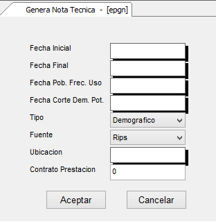

# Elaboración de Novedades TAA

Al generar las notas técnicas se deben tener en cuenta la información que se va a ingresar para tener claridad de que se va a generar. La ventana del aplicativo es el siguiente:  

**Fecha Inicial y Fecha Final:** en estos campos se deben parametrizar los rangos de fechas a tener en cuenta en la información.  
**Fecha Población Frecuencia de Uso:** se debe ingresar la fecha en que la población intervino basado en el rango anterior.  
**Fecha Corte  Dem Pot:** fecha final o de corte al cual se desea calcular los diferentes servicios.  
**Tipo:** en este listBox se escoge depende la necesidad u Organización:  

* _Demográfico:_ referente a la Población esta información se genera automáticamente.  
* _Epidemiológico:_ para la EPS este tema no aplica en la generación de la Ficha.  
* _Frecuencia:_ se genera acorde a toda la información.  
* _Consolidado por Municipio:_ se Consolida por municipios de Acción.  
* _Consolidado por Departamento:_ esto se lleva a cabo cuando su campo de Acción cuenta con más de un departamento, en el caso específico de la EPS Convida no Aplicaría.  
* _Consolidado Total:_ consolidad la información general de todos los diferentes tipos.  

**Fuente:** se establece el origen en que esta recopilada la información:  

* _Rips:_ si la Información se ingresó masivamente por medio de archivos planos.  
* _Autorizaciones:_ se valida los documentos o movimientos autorizados.  

**Ubicación:** se ingresa una ubicación particular parametrizada previamente en la aplicación [**BUBI - Ubicaciones Organización**](http://docs.oasiscom.com/Operacion/common/borgan/bubi) o si es general se establece el 0.  
**Contrato Prestación:** para este caso se deja en 0.  

