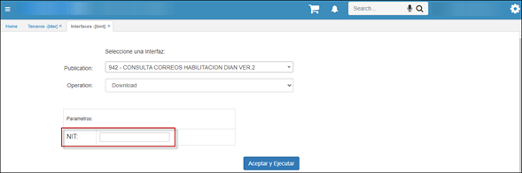

Los mensajes de control que está arrojando el proceso de facturación no son por inconvenientes de OasisCom sino por las múltiples validaciones que la DIAN tiene en el anexo 1.8.   
A continuación, se realizará una breve explicación de los mensajes presentados para que los puedan identificar y dar solución.    

1.	Este mensaje se presenta ya que el tercero o la empresa no cuentan con el respectivo correo que tienen asociado en la aplicación BTER.   

a)	Para dar solución deben ingresar a la aplicación BTER, filtrar en este caso por el tercero el cual le estoy realizando la factura y dirigirme al campo Email, se debe diligenciar el correo que el cliente tenga registrado en la DIAN.   

Dado el caso que el cliente no se encuentre presente, se realizó la configuración de una publicación en la aplicación BINT, al ejecutarla el sistema actualizara el Email del tercero.   

b)	Es importante que si el sistema les sigue arrojando el mismo mensaje de control realicen el procedimiento descrito anteriormente con el NIT de la empresa correspondiente. 
2.	Para dar solución al siguiente mensaje de control  

 
a)	Identificar el tipo de impuesto tanto del tercero como de la empresa.   

 
b)	Posteriormente ingresar a la aplicación BTIM, realizar el filtro por el impuesto que corresponda, tanto del tercero como de la empresa y verificar que el campo código externo se encuentre debidamente diligenciado, deben diligenciarlo según corresponda. 
 

3.	El siguiente mensaje de control que se presenta hace referencia a la ubicación geográfica del tercero  

a)	Para dar solución deben verificar que ubicación geográfica tiene el tercero en la aplicación BTER, posteriormente dirigirse a la aplicación BUBG y realizar el filtro por la ubicación en este caso Medellín. 

b)	Deben verificar que la ubicación cuente con el país y el padre correspondiente, en este caso 169 corresponde a Colombia y el padre 5000 que corresponde Antioquia. 
