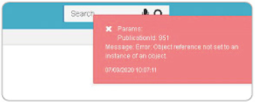

# Subir XML por BINT  

La inconsistencia se presenta al subir un XML por [**Interfaces - BINT**](http://docs.oasiscom.com/Operacion/utility/barchi/bint).  

  

El mensaje de error se presenta porque hacía falta tener parametrizado el código externo en el [**Unidad de medida - BMED**](http://docs.oasiscom.com/Operacion/common/bprodu/bmed) para el campo UnidadMedida 0.  

