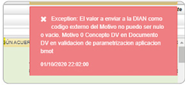

# Concepto DV Documento DV  

Aparece el siguiente error: excepción: el valor a enviar a la Dian como código externo del motivo no puedo ser nulo o vacío. **Motivo 0 concepto DV en documento DV** en validación de parametrización aplicación [**Motivos - BMOT**](http://docs.oasiscom.com/Operacion/common/bsistema/bmot).  

  

Este mensaje se presenta por que el motivo asociado a la nota crédito (aplicación BMOT) no tenía asignado el parámetro de información que requería la DIAN.  

