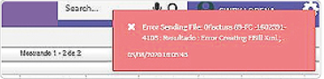

# Documento FC Factura Electrónica  

La inconsistencia es un error en el documento FC de Facturación Electrónica.  

  

La solución consiste en verificar la parametrización de la ubicación geográfica en el campo padre la ubicación que exista, si no existe se debe crear la ubicación.  

