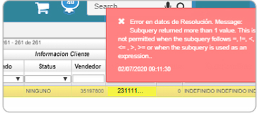

# Error al procesar devoluciones  

La inconsistencia es un error al procesar devoluciones de factura electrónica.  

  

La solución consiste en validar en el [**Resoluciones - FRES**](http://docs.oasiscom.com/Operacion/scm/facturacion/fbasica/fres) que no existan dos resoluciones activas, ya que deben estar procesadas las resoluciones que no están en vigencia.

