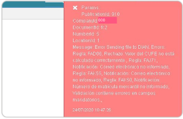

# Error publicación 910 BINT 

La inconsistencia es un error en el BINT Publicación 910.  

  

El mensaje de error se debe a la parametrización del [**Resoluciones - FRES**](http://docs.oasiscom.com/Operacion/scm/facturacion/fbasica/fres). Se debe validar que la clave técnica esté completa, que no tenga datos adicionales o que tenga algunos espacios. De igual manera, se deben verificar las fechas.

