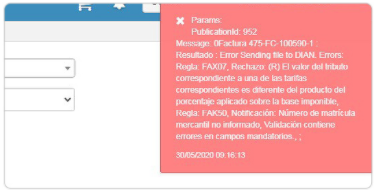

# Error publicación 952 

La inconsistencia es un error en la Publicación 952.  

  

El mensaje de error que emite la DIAN de rechazo puede ser por validación de Tributos, es decir los decimales están separados por COMAS(,) y no por PUNTO(.) como es el deber ser. Para ello se debe modificar el xml colocando los puntos de decimal y se carga nuevamente y se envía exitosamente.  

