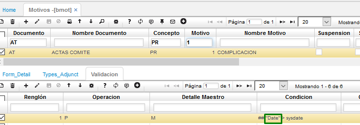

# Movimientos: Función No Valida

A continuación, indicamos lo que se debe realizar para corregir el mensaje de control que arroja la base de datos al momento de confirmar movimientos y el sistema indica una excepción y hace referencia al procedimiento p_OperationValidation: Función No Valida.  

Este mensaje se presenta en aquellos clientes cuyos motores de bases de datos son Oracle, ya que el campo Date, contenido en varias de las tablas del sistema, es una palabra reservada del motor.  

Para poder corregir el mensaje de control, se debe ingresar a la aplicación [**Motivos - BMOT**](http://docs.oasiscom.com/Operacion/common/bsistema/bmot) y consultar el documento, concepto y motivo del movimiento que esta generando el mensaje de control, dar clic en el detalle sobre la pestaña Validación y en el o los registros, en el que el campo Condición contenga la palabra Date, se debe cambiar por “Date” con las comillas dobles, para que al hacer la validación en la base de datos, se pueda interpretar correctamente que pertenece a un campo del objeto al que se está accediendo.  

Para el ejemplo vamos a consultar el Documento: AT, Concepto: PR y Motivo: 1  

Finalmente, una vez se tenga corregido lo mencionado anteriormente, se debe intentar confirmar nuevamente el documento.  

