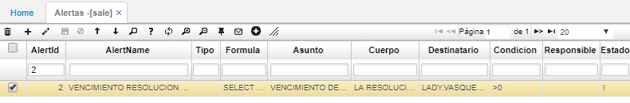
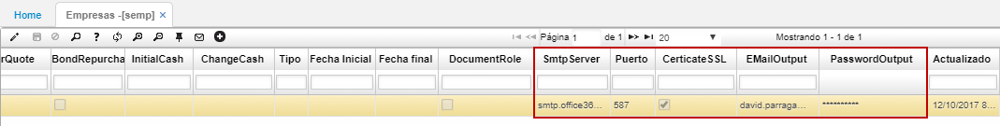

# Parametrización de alertas

Desde la aplicación **SALE - Alertas** debe de existir los registros para cada tipo de:  

**Asunto:** estas son las facturas que se vencen el día de hoy.  
**Cuerpo del mensaje:** cartera vencida.  
**Destinatario correo:** email del destinatario.  
**Estado:** Activo, entre otros.  

Como segunda parametrización, desde la aplicación **SEMP - Empresas** se debe configurar estos cinco campos; tal como se realice en el servidor de correo de cada empresa.  

* SmtpServer
* Port
* CerticateSSL
* EMailOutput
* EMailOutput

De esta manera, de acuerdo a la frecuencia establecida el servidor enviará un mensaje de correo electrónico a los destinatarios con la información de las facturas que vencen en dicha fecha.  
