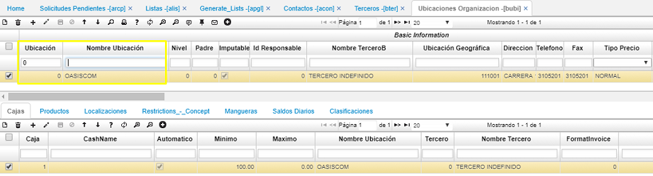
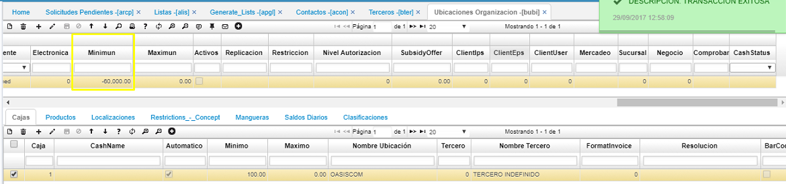

# Movimientos de Tesorería (TMOV): La Ubicación tiene un saldo en Rojo o su saldo es insuficiente

Esté mensaje de control indica que la ubicación para la que se está haciendo el movimiento que muestra en el mensaje de control va a quedar con saldo negativo, para este caso se debe validar la información del banco o caja correspondiente con el fin de validar si es correcto que quede negativo el saldo o no, en caso de que el sistema lo deba permitir se debe realizar la parametrización en el [**BUBI - Básico de ubicaciones**](http://docs.oasiscom.com/Operacion/common/borgan/bubi) para que el sistema permita continuar con el proceso que se está realizando.  

#### BUBI - Básico de ubicaciones

Se hace el filtro por el código de la ubicación que se muestra en el mensaje, para este ejemplo filtramos: Ubicación = 0, allí el sistema me muestra toda la información de la ubicación correspondiente.  

Una vez validada la información de la ubicación, nos desplazamos en el maestro (parte superior) hasta el campo Mínimo (Minimun) y allí debemos poner un rango mínimo en valor negativo, de acuerdo al mínimo valor que el sistema debe permitir en dicha ubicación, también se puede parametrizar un rango Máximo (Maximun).  

Para el caso tomado como ejemplo le parametrizamos en la ubicación 0 un rango mínimo de 60.000, como se muestra resaltado en la imagen anterior.  

Una vez realizada esta parametrización, pueden continuar realizando la transacción de tesorería correspondiente.  