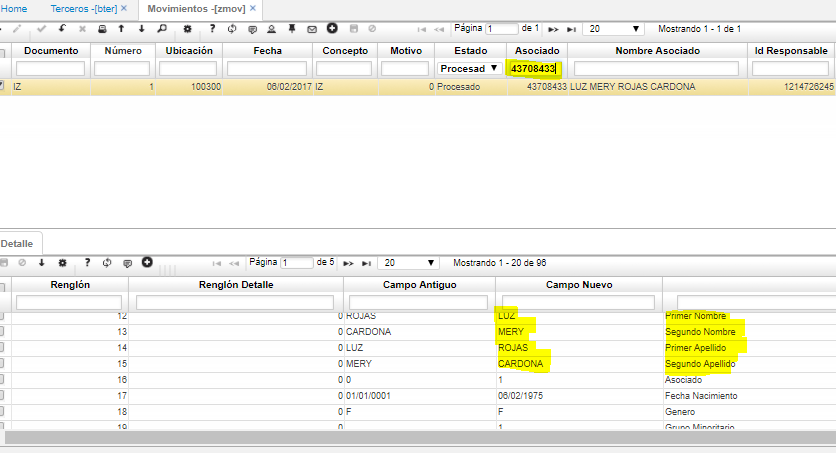
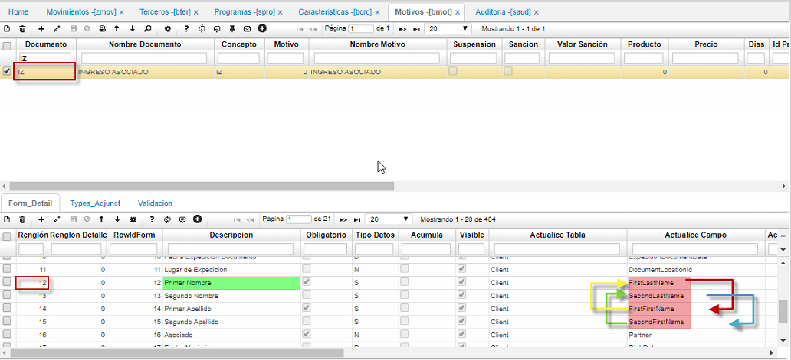
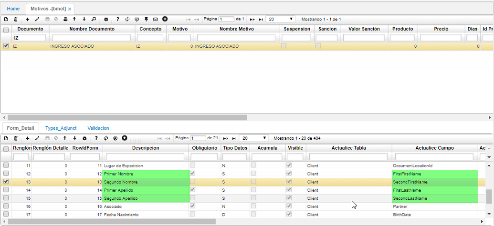

# Al realizar un ingreso por ZNOV, los datos en BTER se ven truncados

Este inconveniente se presenta cuando al realizar el ingreso de un asociado a través del **ZNOV**, se tienen incorrectamente parametrizados los campos a actualizar en el [**BMOT - Motivos**](http://docs.oasiscom.com/Operacion/common/bsistema/bmot), en este caso para el documento **IZ**.  

En la imagen podemos ver que el movimiento de ingreso de asociado se realizó relacionando en el detalle los campos correspondientes al nombre del asociado:

Como se ve la columna _Campo Nuevo_ concuerda con la observación. Sin embargo, al consultar el [**BMOT - Motivos**](http://docs.oasiscom.com/Operacion/common/bsistema/bmot), en el detalle la descripción no concuerda con el campo de la tabla a actualizar:  

Por esta razón, los datos de nombres y apellidos en el [**BTER - Terceros**](http://docs.oasiscom.com/Operacion/common/btercer/bter) se visualizan de forma incorrecta. Para corregir la inconsistencia, se debe parametrizar correctamente el campo a actualizar, de acuerdo a la descripción que tenga:  

