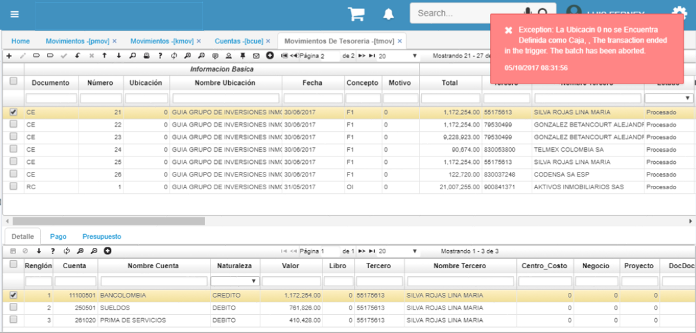
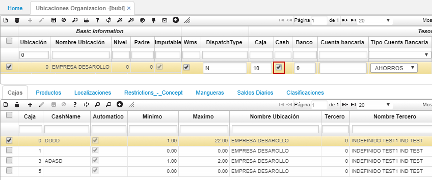

# Ubicación no definida como caja

Al procesar o reversar documentos de tesorería el sistema arroja un mensaje de control que indica que la ubicación cero no está definida como caja.  

El primer análisis es validar la aplicación [**BUBI - Ubicaciones Organización**](http://docs.oasiscom.com/Operacion/common/borgan/bubi).  

Allí consultaremos en el campo _Ubicación_ el número 0, seguidamente en el campo _Cash_ activamos el check como se muestra en la imagen.  

Posteriormente, seguimos trabajando con el documento de tesorería.  